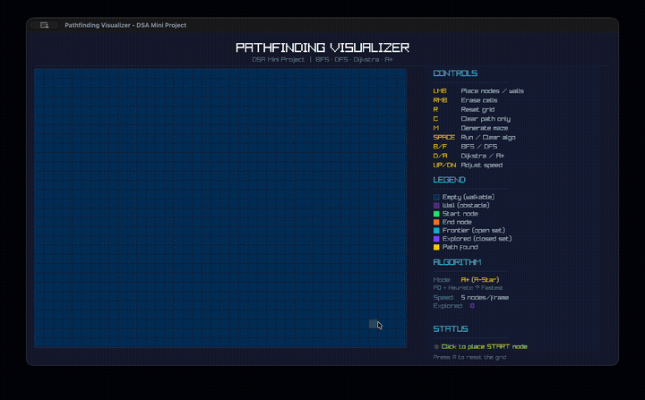

<p align="center">
  
</p>

<h1 align="center">Pathfinding Visualizer</h1>

<p align="center">
  <strong>Real-time graph traversal & shortest-path algorithms, rendered at 60 FPS in pure C.</strong>
</p>

<p align="center">
  <a href="#"></a>
  <a href="https://www.raylib.com"></a>
  <a href="LICENSE"></a>
  <a href="#"></a>
</p>

<br />

<p align="center">
  
</p>

---

## The Problem This Solves

How does a warehouse robot navigate a 50,000 sq. ft. floor without collisions? How does an AGV in a Siemens Smart Factory find the optimal route between stations while avoiding dynamic obstacles?

The answer is **graph search algorithms** — the same ones in this visualizer.

This project is a from-scratch implementation of the four foundational pathfinding algorithms used in autonomous navigation, rendered in real-time so you can **see** how each one thinks. It's not a library wrapper — every data structure (min-heap, queue, stack) is hand-rolled in C with zero external dependencies beyond the graphics layer.

---

## Features

| | Feature | Detail |
|---|---|---|
| 🔍 | **4 Algorithms** | BFS, DFS, Dijkstra's, and A* — all visualized side-by-side on the same grid |
| 🏗️ | **Maze Generation** | Recursive Backtracker (DFS-based) generates perfect mazes with a single keypress |
| ⚡ | **60 FPS Rendering** | Frame-by-frame algorithm stepping creates smooth, real-time animation |
| 🧱 | **Interactive Grid** | Click to place start/end nodes, draw walls, or generate random mazes |
| 📊 | **Live Metrics** | Nodes explored, path length, and algorithm state displayed in real-time |
| 🎛️ | **Speed Control** | Adjust animation speed from 1 to 50 nodes/frame with arrow keys |
| 🧠 | **Custom Data Structures** | Hand-written Binary Min-Heap (priority queue), circular Queue, and array Stack — no `std::priority_queue`, no STL |
| 📐 | **Modular Architecture** | Clean separation: `grid.c` → data, `pathfinder.c` → algorithms, `renderer.c` → graphics |

---

## Controls

| Key | Action |
|-----|--------|
| `B` | Select **BFS** (Breadth-First Search) |
| `F` | Select **DFS** (Depth-First Search) |
| `D` | Select **Dijkstra's** algorithm |
| `A` | Select **A*** algorithm |
| `M` | Generate a random **maze** |
| `Space` | **Run** selected algorithm / Clear results |
| `R` | **Reset** entire grid |
| `C` | **Clear** path overlay (keep walls) |
| `↑` `↓` | Adjust animation **speed** |
| `LMB` | Place start → end → walls |
| `RMB` | Erase cells |

---

## Technical Stack

```
Language     C99 (gcc, clang)
Graphics     Raylib 5.x
Build        GNU Make
Platform     macOS (Homebrew) · Linux (apt)
Lines        ~1,800 across 8 source files
Dependencies Raylib only — all data structures are hand-written
```

---

## Build & Run

### Prerequisites

**macOS** (Homebrew):
```bash
brew install raylib
```

**Linux** (apt):
```bash
sudo apt install libraylib-dev
```

### Compile & Launch

```bash
git clone https://github.com/YOUR_USERNAME/pathfinding-visualizer.git
cd pathfinding-visualizer

make        # Compile
make run    # Compile + launch
make clean  # Remove build artifacts
```

> [!NOTE]
> On macOS, the Makefile auto-detects Raylib's install path via `brew --prefix raylib`. On Linux, you may need to adjust `CFLAGS` and `LDFLAGS` in the Makefile to point to your Raylib installation.

---

## Under the Hood

### Architecture

```
┌──────────┐     ┌──────────┐     ┌──────────────┐
│  main.c  │────▶│  grid.c  │     │  renderer.c  │
│  (loop)  │     │  (data)  │     │  (drawing)   │
└──────────┘     └──────────┘     └──────────────┘
     │                │                   ▲
     │           ┌────────────┐           │
     └──────────▶│pathfinder.c│───────────┘
                 │  (algos)   │
                 └────────────┘
                      │
              ┌───────┴────────┐
              │priority_queue.c│
              │ queue_stack.h  │
              └────────────────┘
```

The main loop runs at 60 FPS using Raylib's game loop pattern. Each frame: **Input → Update → Draw**. The pathfinder processes a configurable batch of nodes per frame, creating the animated visualization.

### Algorithm Comparison

| Algorithm | Data Structure | Shortest Path? | Time Complexity | Behavior |
|-----------|---------------|----------------|-----------------|----------|
| **BFS** | Queue (FIFO) | ✅ Yes (unweighted) | O(V + E) | Explores level-by-level in "waves" |
| **DFS** | Stack (LIFO) | ❌ No | O(V + E) | Dives deep, then backtracks |
| **Dijkstra** | Min-Heap | ✅ Yes (weighted) | O(E log V) | Explores nearest-first in all directions |
| **A*** | Min-Heap + Heuristic | ✅ Yes (weighted) | O(E log V) | Explores toward the goal |

### Why A* Outperforms Dijkstra

Both algorithms find the **optimal shortest path**. The difference is *how many nodes they waste exploring*.

**Dijkstra** uses `priority = g(n)` — the cost from start. It expands outward like a circle, exploring nodes in every direction equally, even away from the goal.

**A*** uses `priority = g(n) + h(n)` — the cost from start **plus** an estimate to the goal. The heuristic `h(n)` is the **Manhattan Distance**: `|row - goal_row| + |col - goal_col|`. This biases the search toward the destination, forming a diamond-shaped frontier instead of a circle.

```
  Dijkstra explores:         A* explores:
    . . X . .                  . . . . .
    . X X X .                  . . X . .
    X X S X X                  . X S X .
    . X X X .                  . X X X .
    . . X . .                  . X X X G
                                 ↗ biased toward goal
```

**Result:** A* explores 40–70% fewer nodes on average while guaranteeing the same optimal path. This is why A* is the industry standard in game AI, robotics, and AGV navigation — identical correctness, dramatically better performance.

### Maze Generation: Recursive Backtracker

The maze generator uses an **iterative DFS** with an explicit stack (not recursion, to avoid stack overflow on large grids):

1. Fill the grid entirely with walls
2. Start at cell `(1,1)`, mark it as a passage
3. Randomly pick an unvisited neighbor **2 cells away**
4. Carve a passage through the wall between them
5. Push the new cell and repeat
6. When stuck → **backtrack** (pop the stack, try other directions)

This produces a **perfect maze** — exactly one path between any two cells, no loops, no isolated regions. The 2-cell stepping ensures walls exist between every corridor.

### Custom Min-Heap (Priority Queue)

Rather than relying on any library, the priority queue is a **hand-written array-backed binary min-heap**:

```
      Index:    0        ← Root (minimum)
               / \
              1   2
             / \ / \
            3  4 5  6

  Parent:      (i - 1) / 2
  Left child:  2 * i + 1
  Right child: 2 * i + 2
```

- **Push:** O(log n) — insert at bottom, sift up
- **Pop:** O(log n) — swap root with last, sift down
- **Peek:** O(1) — read the root
- Stack-allocated array (no `malloc`), cache-friendly, zero fragmentation

---

## Project Structure

```
.
├── main.c              # Entry point, game loop, input handling
├── grid.c / grid.h     # Grid data model, mouse interaction, maze generation
├── pathfinder.c / .h   # BFS, DFS, Dijkstra, A* implementations
├── priority_queue.c/.h # Custom binary min-heap
├── queue_stack.h       # Queue (BFS) and Stack (DFS) — header-only
├── renderer.c / .h     # Raylib drawing, sidebar, color palette
└── Makefile            # Build system (macOS + Linux)
```

---

## License

This project is licensed under the [MIT License](LICENSE).

---

<p align="center">
  Built with C, curiosity, and way too much time staring at expanding frontiers.
</p>
